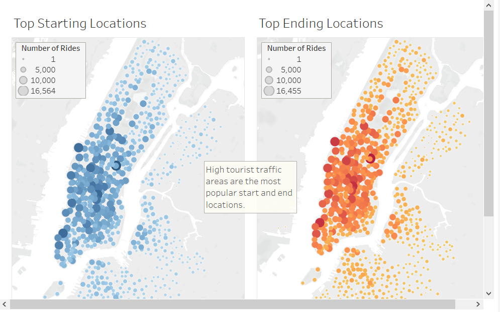

Visualizations of bike sharing data using Tableau

# **Citibike **

## **Overview of Project**

The data used for this project was downloaded from [Citibike trip history data](https://ride.citibikenyc.com/system-data) on their ride Citibike NYC website. To get to the csv's for download, click on the link "Download Citi Bike trip history data". The csv used here will come in a zip file that is labeled *201908-citibike-tripdata.csv.zip* in the list of datasets.

## **Results**
### **Convert Trip Duration to Datetime**

    

### **Ride Durations by All Users**

    

### **Ride Durations by Gender**

    

### **Trips by All Users (Weekday per Hour)**

    

### **Trips by Gender (Weekday per Hour)**

    

### **Trips by Demographic by Weekday**

    

### **Average Trip Duration**

    

### **Top Start and End Locations**

    

### **User Demographics**

    

## **Summary**
